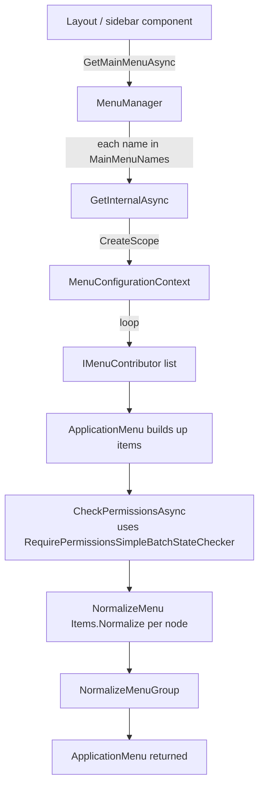

`Volo.Abp.UI.Navigation` is the UI-agnostic menu system the ABP Framework ships. It defines `ApplicationMenu`, `ApplicationMenuItem`, the contributor model that every module uses to add items to those menus, and the `AppUrlProvider` that resolves cross-application URLs in multi-tenant deployments. This page walks every type under `framework/src/Volo.Abp.UI.Navigation/Volo/Abp/Ui/Navigation/` and explains how the resulting `ApplicationMenu` becomes the data behind a sidebar in the basic theme or the top-bar in LeptonX.

## Where it lives in the stack

`Volo.Abp.UI.Navigation` is referenced by `AbpAspNetCoreMvcUiModule` (`framework/src/Volo.Abp.AspNetCore.Mvc.UI/Volo/Abp/AspNetCore/Mvc/UI/AbpAspNetCoreMvcUiModule.cs`) so every MVC UI host gets it for free. It is also pulled in by the Blazor and Angular UI bundles — the same `IMenuContributor` API works across all three.

`framework/src/Volo.Abp.UI.Navigation/Volo/Abp/Ui/Navigation/AbpUiNavigationModule.cs`:

```csharp
[DependsOn(typeof(AbpUiModule), typeof(AbpAuthorizationModule), typeof(AbpMultiTenancyModule))]
public class AbpUiNavigationModule : AbpModule
{
    public override void ConfigureServices(ServiceConfigurationContext context)
    {
        Configure<AbpVirtualFileSystemOptions>(options =>
        {
            options.FileSets.AddEmbedded<AbpUiNavigationModule>();
        });

        Configure<AbpLocalizationOptions>(options =>
        {
            options.Resources
                .Add<AbpUiNavigationResource>("en")
                .AddVirtualJson("/Volo/Abp/Ui/Navigation/Localization/Resource");
        });

        Configure<AbpNavigationOptions>(options =>
        {
            options.MenuContributors.Add(new DefaultMenuContributor());
        });
    }
}
```

Three things happen:

1. The `AbpUiNavigationResource` localization resource is registered (so menus can be localized).
2. `DefaultMenuContributor` is added so the `Administration` menu item appears even if no other module contributes.
3. The module depends on `AbpMultiTenancyModule` because `AppUrlProvider` consults `IMultiTenantUrlProvider` to substitute tenant placeholders into URLs (see [`/multi-tenancy/aspnetcore-multitenancy`](/multi-tenancy/aspnetcore-multitenancy)).

## Folder map

| Folder | Purpose | Key types |
| --- | --- | --- |
| (root) | Menus + contributors | `AbpNavigationOptions`, `IMenuManager`, `MenuManager`, `IMenuContributor`, `DefaultMenuContributor`, `MenuConfigurationContext`, `ApplicationMenu`, `ApplicationMenuItem`, `ApplicationMenuGroup`, `ApplicationMenuItemList`, `ApplicationMenuGroupList`, `StandardMenus`, `DefaultMenuNames`, `IHasMenuItems`, `IHasMenuGroups`, `HasMenuItemsExtensions` |
| `Urls/` | Cross-app URL resolution | `AppUrlOptions`, `AppUrlProvider`, `IAppUrlProvider`, `ApplicationUrlDictionary`, `ApplicationUrlInfo` |
| `Localization/Resource/` | Default menu labels | `AbpUiNavigationResource` |

## Options + standard names

`AbpNavigationOptions.cs`:

```csharp
public class AbpNavigationOptions
{
    [NotNull]
    public List<IMenuContributor> MenuContributors { get; }

    /// <summary>
    /// Includes the <see cref="StandardMenus.Main"/> by default.
    /// </summary>
    public List<string> MainMenuNames { get; }

    public AbpNavigationOptions()
    {
        MenuContributors = new List<IMenuContributor>();
        MainMenuNames = new List<string> { StandardMenus.Main };
    }
}
```

`StandardMenus.cs`:

```csharp
public static class StandardMenus
{
    public const string Main = "Main";
    public const string User = "User";
    public const string Shortcut = "Shortcut";
}
```

| Menu name | Used for |
| --- | --- |
| `Main` | The primary sidebar / top navigation |
| `User` | The current-user dropdown ("My account", "Log out") |
| `Shortcut` | A quick-actions list rendered in some themes |

`DefaultMenuNames.cs` reserves a `Administration` slot inside `Main`:

```csharp
public static class DefaultMenuNames
{
    public static class Application
    {
        public static class Main
        {
            public const string Administration = "Abp.Application.Main.Administration";
        }
    }
}
```

Account, Identity, Tenant Management, etc., all add themselves *under* `Abp.Application.Main.Administration` so the layout is consistent.

## `ApplicationMenu`

`ApplicationMenu.cs` is the root of the navigation tree:

```csharp
public class ApplicationMenu : IHasMenuItems, IHasMenuGroups
{
    [NotNull] public string Name { get; }
    [NotNull] public string DisplayName { get; set; }
    [NotNull] public ApplicationMenuItemList Items { get; }
    [NotNull] public ApplicationMenuGroupList Groups { get; }
    [NotNull] public Dictionary<string, object> CustomData { get; } = new();

    public ApplicationMenu([NotNull] string name, string? displayName = null)
    {
        Check.NotNullOrWhiteSpace(name, nameof(name));
        Name = name;
        DisplayName = displayName ?? Name;
        Items = new ApplicationMenuItemList();
        Groups = new ApplicationMenuGroupList();
    }

    public ApplicationMenu AddItem([NotNull] ApplicationMenuItem menuItem) { Items.Add(menuItem); return this; }
    public ApplicationMenu AddGroup([NotNull] ApplicationMenuGroup group) { Groups.Add(group); return this; }
    public ApplicationMenu WithCustomData(string key, object value) { CustomData[key] = value; return this; }
}
```

A menu is named (e.g. `"Main"`), carries an ordered list of items, and optionally carries menu groups that items can reference by `GroupName`.

## `ApplicationMenuItem`

`ApplicationMenuItem.cs` is the leaf / branch node:

```csharp
public class ApplicationMenuItem : IHasMenuItems, IHasSimpleStateCheckers<ApplicationMenuItem>
{
    public const int DefaultOrder = 1000;

    [NotNull] public string Name { get; }
    [NotNull] public string DisplayName { get; set; }
    public int Order { get; set; }
    public string? Url { get; set; }
    public string? Icon { get; set; }
    public bool IsLeaf => Items.IsNullOrEmpty();
    public string? Target { get; set; }
    public bool IsDisabled { get; set; }
    [NotNull] public ApplicationMenuItemList Items { get; }
    public List<ISimpleStateChecker<ApplicationMenuItem>> StateCheckers { get; }
    [NotNull] public Dictionary<string, object> CustomData { get; } = new();
    public string? ElementId { get; set; }
    public string? CssClass { get; set; }
    public string? GroupName { get; set; }

    public ApplicationMenuItem(
        [NotNull] string name,
        [NotNull] string displayName,
        string? url = null,
        string? icon = null,
        int order = DefaultOrder,
        string? target = null,
        string? elementId = null,
        string? cssClass = null,
        string? groupName = null,
        string? requiredPermissionName = null) { /* ... */ }
}
```

| Property | Notes |
| --- | --- |
| `Name` | Globally unique inside its parent menu |
| `Url` | Either a relative path or a token like `{tenantName}.MyApp.com/...` |
| `Order` | Lower numbers come first; default is `1000` |
| `Target` | HTML `target` (`_blank`, `_self`, etc.) |
| `IsLeaf` | Computed: true if no child items |
| `StateCheckers` | Predicates (typically permission policies) — failing ones cause removal |
| `GroupName` | Optional group reference for hierarchical layouts |
| `ElementId` / `CssClass` | DOM hooks for themes |

State checkers are evaluated as a batch — see `MenuManager.CheckPermissionsAsync` below.

## `ApplicationMenuItemList` — normalization

`ApplicationMenuItemList.cs`:

```csharp
public class ApplicationMenuItemList : List<ApplicationMenuItem>
{
    public void Normalize()
    {
        RemoveEmptyItems();
        Order();
    }

    private void RemoveEmptyItems()
    {
        RemoveAll(item => item.IsLeaf && item.Url.IsNullOrEmpty());
    }

    private void Order()
    {
        var orderedItems = this.OrderBy(item => item.Order).ToArray();
        Clear();
        AddRange(orderedItems);
    }
}
```

`Normalize` is called by the manager after every contributor runs:

* `RemoveEmptyItems` strips leaf items without a `Url` — typically these are administration container items whose children were all denied by permission checks.
* `Order` sorts by `Order` ascending.

## `ApplicationMenuGroup`

`ApplicationMenuGroup.cs` lets themes render section headers:

```csharp
public class ApplicationMenuGroup
{
    public const int DefaultOrder = 1000;

    [NotNull] public string Name { get; }
    [NotNull] public string DisplayName { get; set; }
    public string? ElementId { get; set; }
    public int Order { get; set; } = DefaultOrder;
    public string? Icon { get; set; }
    [NotNull] public Dictionary<string, object> CustomData { get; } = new();
}
```

Menu items reference a group by `GroupName`. The manager's `NormalizeMenuGroup` removes the `GroupName` from any item whose target group was never declared (so the item still renders, just at the top level).

## Contributor model

`IMenuContributor.cs`:

```csharp
public interface IMenuContributor
{
    Task ConfigureMenuAsync(MenuConfigurationContext context);
}
```

`MenuConfigurationContext.cs`:

```csharp
public class MenuConfigurationContext : IMenuConfigurationContext
{
    public IServiceProvider ServiceProvider { get; }
    public IAuthorizationService AuthorizationService { get; }
    public IStringLocalizerFactory StringLocalizerFactory { get; }
    public ApplicationMenu Menu { get; }

    public Task<bool> IsGrantedAsync(string policyName) => AuthorizationService.IsGrantedAsync(policyName);
    public IStringLocalizer? GetDefaultLocalizer() => StringLocalizerFactory.CreateDefaultOrNull();
    public IStringLocalizer GetLocalizer<T>() => StringLocalizerFactory.Create<T>();
    public IStringLocalizer GetLocalizer(Type resourceType) => StringLocalizerFactory.Create(resourceType);
}
```

The context is constructed *per request*, with a fresh service scope, and exposes the menu being built plus everything a contributor typically needs: localization, authorization, and the DI container for ad-hoc service lookups.

### `DefaultMenuContributor`

`DefaultMenuContributor.cs`:

```csharp
public class DefaultMenuContributor : IMenuContributor
{
    public virtual Task ConfigureMenuAsync(MenuConfigurationContext context)
    {
        Configure(context);
        return Task.CompletedTask;
    }

    protected virtual void Configure(MenuConfigurationContext context)
    {
        var l = context.GetLocalizer<AbpUiNavigationResource>();

        if (context.Menu.Name == StandardMenus.Main)
        {
            context.Menu.AddItem(
                new ApplicationMenuItem(
                    DefaultMenuNames.Application.Main.Administration,
                    l["Menu:Administration"],
                    icon: "fa fa-wrench"
                )
            );
        }
    }
}
```

Every contributor inspects `context.Menu.Name` to react only to the menus it has opinions about. The default contributor adds the `Administration` parent item; downstream modules nest their items under it.

## `MenuManager` — the runtime

`MenuManager.cs` is the orchestrator. The flow:



Source:

```csharp
public Task<ApplicationMenu> GetMainMenuAsync()
{
    return GetAsync(Options.MainMenuNames.ToArray());
}

protected virtual async Task<ApplicationMenu> GetAsync(params string[] menuNames)
{
    if (menuNames.IsNullOrEmpty())
    {
        return new ApplicationMenu(StandardMenus.Main);
    }

    var menus = new List<ApplicationMenu>();

    foreach (var menuName in Options.MainMenuNames)
    {
        menus.Add(await GetInternalAsync(menuName));
    }

    return MergeMenus(menus);
}

protected virtual async Task<ApplicationMenu> GetInternalAsync(string name)
{
    var menu = new ApplicationMenu(name);

    using (var scope = ServiceScopeFactory.CreateScope())
    {
        using (RequirePermissionsSimpleBatchStateChecker<ApplicationMenuItem>.Use(new RequirePermissionsSimpleBatchStateChecker<ApplicationMenuItem>()))
        {
            var context = new MenuConfigurationContext(menu, scope.ServiceProvider);

            foreach (var contributor in Options.MenuContributors)
            {
                await contributor.ConfigureMenuAsync(context);
            }

            await CheckPermissionsAsync(scope.ServiceProvider, menu);
        }
    }

    NormalizeMenu(menu);
    NormalizeMenuGroup(menu);

    return menu;
}
```

### Merging multiple "main" menus

`MainMenuNames` is a list — typically just `["Main"]` but applications can add more. `MergeMenus` glues the items from later menus into the first:

```csharp
protected virtual ApplicationMenu MergeMenus(List<ApplicationMenu> menus)
{
    Check.NotNullOrEmpty(menus, nameof(menus));

    if (menus.Count == 1)
    {
        return menus[0];
    }

    var firstMenu = menus[0];

    for (int i = 1; i < menus.Count; i++)
    {
        var currentMenu = menus[i];
        foreach (var menuItem in currentMenu.Items)
        {
            firstMenu.AddItem(menuItem);
        }
    }

    return firstMenu;
}
```

## Batched permission checks

`CheckPermissionsAsync` is the performance-critical part — it collects every item that has a `StateCheckers` and runs them as a batch, then removes the ones that fail:

```csharp
protected virtual async Task CheckPermissionsAsync(IServiceProvider serviceProvider, IHasMenuItems menuWithItems)
{
    var allMenuItems = new List<ApplicationMenuItem>();
    GetAllMenuItems(menuWithItems, allMenuItems);

    foreach (var item in allMenuItems)
    {
        if (!item.RequiredPermissionName.IsNullOrWhiteSpace())
        {
            item.RequirePermissions(item.RequiredPermissionName!);
        }
    }

    var checkPermissionsMenuItems = allMenuItems.Where(x => x.StateCheckers.Any()).ToArray();

    if (checkPermissionsMenuItems.Any())
    {
        var toBeDeleted = new HashSet<ApplicationMenuItem>();
        var result = await SimpleStateCheckerManager.IsEnabledAsync(checkPermissionsMenuItems);
        foreach (var menu in checkPermissionsMenuItems)
        {
            if (!result[menu])
            {
                toBeDeleted.Add(menu);
            }
        }

        RemoveMenus(menuWithItems, toBeDeleted);
    }
}
```

The batch checker (`RequirePermissionsSimpleBatchStateChecker`) groups permission lookups so a menu with 50 items requires one round-trip to the permission store, not 50.

### Normalization recursion

```csharp
protected virtual void NormalizeMenu(IHasMenuItems menuWithItems)
{
    foreach (var item in menuWithItems.Items)
    {
        NormalizeMenu(item);
    }

    menuWithItems.Items.Normalize();
}
```

Notice the recursion: leaves are normalized first, then their parents. That's why empty-item removal cascades — if the deepest level becomes empty, its parent (now leaf without URL) is removed on the next pass up.

## Authoring a menu contributor

The canonical pattern: subclass `IMenuContributor`, branch on `context.Menu.Name`, and nest your items under `DefaultMenuNames.Application.Main.Administration`.

```csharp
public class CustomerManagementMenuContributor : IMenuContributor
{
    public async Task ConfigureMenuAsync(MenuConfigurationContext context)
    {
        if (context.Menu.Name != StandardMenus.Main) return;

        var l = context.GetLocalizer<CustomerManagementResource>();

        var admin = context.Menu.GetAdministration();
        admin.AddItem(new ApplicationMenuItem(
            name: "CustomerManagement",
            displayName: l["Menu:CustomerManagement"],
            url: "/customers",
            icon: "fa fa-users",
            order: 1
        ).RequirePermissions(CustomerManagementPermissions.Default));
    }
}
```

Register inside `ConfigureServices`:

```csharp
Configure<AbpNavigationOptions>(options =>
{
    options.MenuContributors.Add(new CustomerManagementMenuContributor());
});
```

`GetAdministration()` is a typical helper exposed by `HasMenuItemsExtensions` in the same folder — it does `menu.Items.FirstOrDefault(i => i.Name == DefaultMenuNames.Application.Main.Administration)`.

## App URLs

`Urls/AppUrlOptions.cs`:

```csharp
public class AppUrlOptions
{
    public ApplicationUrlDictionary Applications { get; }
    public List<string> RedirectAllowedUrls { get; }

    public AppUrlOptions()
    {
        Applications = new ApplicationUrlDictionary();
        RedirectAllowedUrls = new List<string>();
    }
}
```

`Urls/AppUrlProvider.cs`:

```csharp
public class AppUrlProvider : IAppUrlProvider, ITransientDependency
{
    public virtual async Task<string> GetUrlAsync(string appName, string? urlName = null)
    {
        return await MultiTenantUrlProvider.GetUrlAsync(
            await GetConfiguredUrl(appName, urlName)
        );
    }

    public virtual async Task<bool> IsRedirectAllowedUrlAsync(string url)
    {
        var redirectAllowedUrls = new List<string>();
        foreach (var redirectAllowedUrl in Options.RedirectAllowedUrls)
        {
            redirectAllowedUrls.Add((await NormalizeUrlAsync(redirectAllowedUrl))!);
        }
        var allow = redirectAllowedUrls.Any(x => url.StartsWith(x, StringComparison.CurrentCultureIgnoreCase) ||
                                                 UrlHelpers.IsSubdomainOf(url, x));
        if (!allow)
        {
            Logger.LogError($"Invalid RedirectUrl: {url}, Use {nameof(AppUrlProvider)} to configure it!");
        }
        return allow;
    }

    public virtual async Task<string?> NormalizeUrlAsync(string? url)
    {
        if (string.IsNullOrWhiteSpace(url))
        {
            return url;
        }

        return await MultiTenantUrlProvider.GetUrlAsync(url!);
    }
}
```

The flow is:

1. Modules register named applications in `AppUrlOptions.Applications` (e.g. `MVC` → `https://app.example.com`, `Angular` → `https://app.example.com`).
2. Menu items / Razor pages call `appUrlProvider.GetUrlAsync("MVC", "Account/Profile")` to resolve the absolute URL.
3. `IMultiTenantUrlProvider` substitutes `{0}` or `{tenantName}` placeholders against the current tenant.
4. The same provider checks `IsRedirectAllowedUrlAsync` for OAuth post-login redirects — `AbpPageModel.NormalizeReturnUrlAsync` (covered in [MVC UI core](./mvc-ui)) calls this.

`RedirectAllowedUrls` is the host's whitelist for redirects that escape the current application — for example, the external account login can post back to a different SPA.

```csharp
Configure<AppUrlOptions>(options =>
{
    options.Applications["MVC"].RootUrl = "https://{tenantName}.app.example.com";
    options.Applications["MVC"].Urls["Account/Profile"] = "https://{tenantName}.app.example.com/Account/Manage";

    options.RedirectAllowedUrls.AddRange(new[]
    {
        "https://{tenantName}.angular.example.com",
        "https://{tenantName}.mobile.example.com"
    });
});
```

## Rendering a menu

The MVC theme reads the resolved menu inside a view component:

```csharp
public class MainNavbarMenuViewComponent : AbpViewComponent
{
    private readonly IMenuManager _menuManager;
    public MainNavbarMenuViewComponent(IMenuManager menuManager) => _menuManager = menuManager;

    public async Task<IViewComponentResult> InvokeAsync()
    {
        var menu = await _menuManager.GetMainMenuAsync();
        return View(menu);
    }
}
```

The basic theme's `Themes/Basic/Components/Menu/MainNavbarMenuViewComponent.cs` does exactly this. Razor partials then iterate `menu.Items` and recurse into `Items.Items` to render nested levels.

## Cross-UI consistency

| UI | Reads `IMenuManager` from | Notes |
| --- | --- | --- |
| MVC | A view component in the theme | Sync per request |
| Blazor Server | A scoped service in the layout | Same lifecycle as MVC |
| Blazor WebAssembly | A scoped service initialized on first navigation | Cached client-side |
| Angular | The Angular config service translates menu DTOs into ng-zorro structures | Fetched from `/api/abp/application-configuration` |

The same `MenuContributor` written for MVC works in Blazor — see [`/blazor/overview`](/blazor/overview) for the Blazor-side `MenuManager`.

## Recipes

<AccordionGroup>
  <Accordion title="Add a top-level item only for admins">
    ```csharp
    if (context.Menu.Name == StandardMenus.Main && await context.IsGrantedAsync(AdminPermissions.Default))
    {
        context.Menu.AddItem(new ApplicationMenuItem(
            "Reports", l["Reports"], "/reports", icon: "fa fa-chart-line"));
    }
    ```
  </Accordion>
  <Accordion title="Group items under a section">
    ```csharp
    var menu = context.Menu;
    menu.AddGroup(new ApplicationMenuGroup("Sales", l["Group:Sales"]));
    menu.AddItem(new ApplicationMenuItem("Orders", l["Orders"], "/orders") { GroupName = "Sales" });
    menu.AddItem(new ApplicationMenuItem("Invoices", l["Invoices"], "/invoices") { GroupName = "Sales" });
    ```
  </Accordion>
  <Accordion title="Add an item to the user dropdown">
    ```csharp
    if (context.Menu.Name == StandardMenus.User)
    {
        context.Menu.AddItem(new ApplicationMenuItem("Help", l["Help"], "/help"));
    }
    ```
  </Accordion>
  <Accordion title="Resolve a multi-tenant URL">
    ```csharp
    var profileUrl = await appUrlProvider.GetUrlAsync("MVC", "Account/Profile");
    ```
  </Accordion>
</AccordionGroup>

## Related pages

<CardGroup cols={2}>
  <Card title="MVC UI core" href="./mvc-ui">
    `AbpPageModel.NormalizeReturnUrlAsync` consumes `IAppUrlProvider.IsRedirectAllowedUrlAsync`.
  </Card>
  <Card title="Theme shared" href="./theme-shared">
    Toolbars sit next to menus in theme layouts.
  </Card>
  <Card title="Multi-tenancy UI" href="./multi-tenancy-ui">
    Tenant switching combined with `AppUrlOptions`.
  </Card>
  <Card title="ASP.NET multi-tenancy" href="/multi-tenancy/aspnetcore-multitenancy">
    The `IMultiTenantUrlProvider` consumed by `AppUrlProvider`.
  </Card>
  <Card title="Blazor overview" href="/blazor/overview">
    Blazor uses the same `IMenuContributor` API.
  </Card>
</CardGroup>
